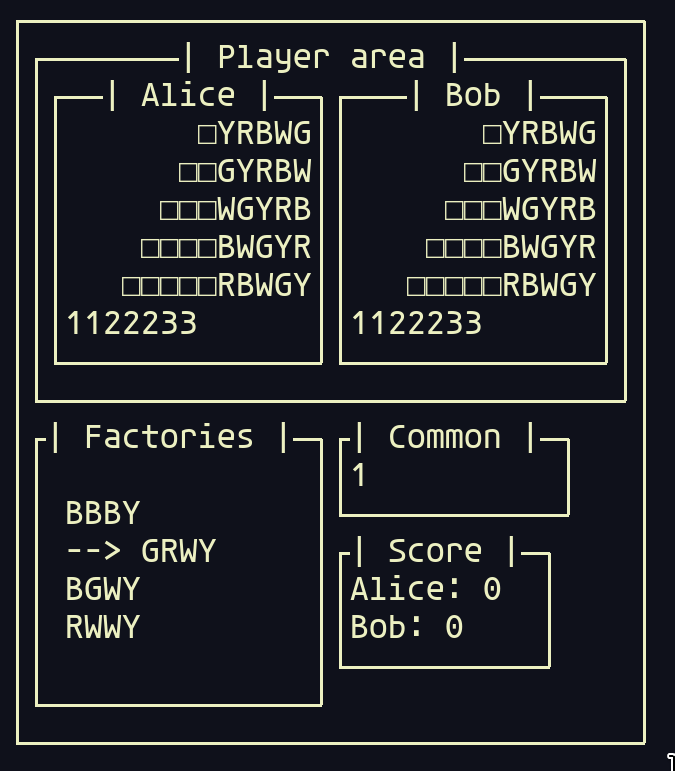

# Azul in rust

My pet project for learning rust, an implementation of the board game called [Azul](https://boardgamegeek.com/boardgame/230802/azul) (the first version).

It looks like this right now:



At the moment it's two players only, with no remote multiplayer (so both players would have to sit at the same computer). There is a really basic TUI interface that I threw together using [termion](https://crates.io/crates/termion), which unfortunately doesn't lend itself well to playing the game, unless you already know the rules.

Only about 40% of the game is implemented currently.

## Possible improvements as I go along

- [ ] Actually finish the game logic
- [ ] Have some kind of rules/legend explanation
- [ ] Play with 3-4 players
- [ ] Remote multiplayer
- [x] Improve the view rendering

## Tests
A major reason why I wanted to write my own TUI, and keep it without any styling (like colors) is that I can write tests like this:

```rust
#[test]
fn test_two_panels_horizontally() {
    let hellos = ["Hello", "Hello"]
        .into_iter()
        .map(|s| {
            let panel = PanelBuilder::default()
                .component(Box::new(TextView::new(String::from(s))) as Box<_>)
                .build()
                .unwrap();
            Box::new(panel) as Box<_>
        })
        .collect();
    let panel = PanelBuilder::default()
        .component(Box::new(Layout::horizontal(0, hellos)))
        .build()
        .unwrap();
    let expected = r#"
┌──────────────┐
│┌─────┐┌─────┐│
││Hello││Hello││
│└─────┘└─────┘│
└──────────────┘"#
        .trim_start();
    expect_component(panel, expected);
}
```
Basically, I can write the ASCII representation of a component inside the test, and assert against that, which is really neat. Of course the rendering code turned out to be harder than I expected, and I have to manually fiddle with dimensions right now, but hopefully I'll get that ironed out.
